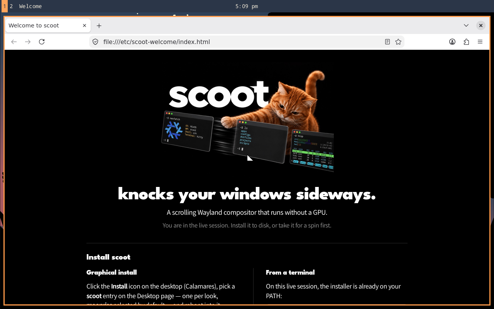
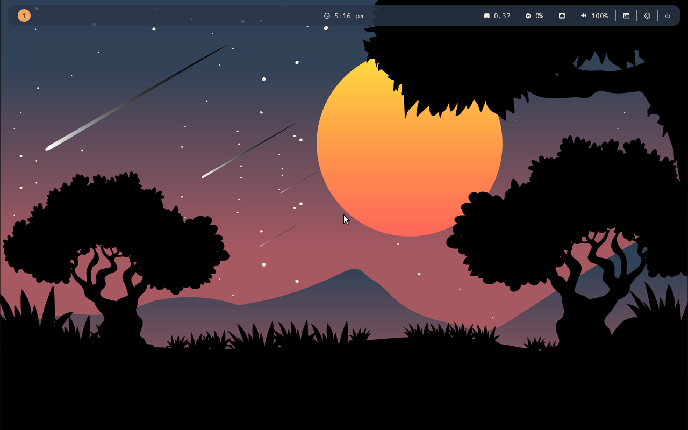

# scoot-iso

A NixOS live + installer ISO with the scoot desktop: boot the USB stick
and you are in a full scoot session; run the installer and the target
gets the scoot desktop profile with the ReGreet login screen.

> Screenshots (QEMU screendumps taken by `scripts/qemu-test.sh` in CI,
> never hand captures):
>
> 
> 
>
> The live session opens the welcome window; the installed bar wears
> each look's own example layout (workspaces and window title left,
> clock center, system modules with their icons right).

## One command

```sh
nix build github:scoot-sh/scoot-iso#iso
```

That builds for your Nix system (`x86_64-linux` or `aarch64-linux`;
pick `.iso.x86_64-linux` / `.iso.aarch64-linux` explicitly). The same
system is also available as a flake output for `nixos-rebuild`:

```sh
nixos-rebuild build-image --image-variant iso-installer \
  --flake github:scoot-sh/scoot-iso#scoot-live-x86_64-linux
```

Without nix, the same build runs in Docker (pinned official
`nixos/nix` image, scoot Cachix plus cache.nixos.org so most of it
downloads); the `.iso` lands in `./scoot-iso-out/` owned by you:

```sh
scripts/build-iso-docker.sh
```

`ISO_PLATFORM=linux/amd64` builds x86_64 on an ARM Mac (emulated,
slow); natively each arch builds its own ISO. The script prints
elapsed time and the output listing; `scripts/build-iso-docker.sh
--check` runs `nix flake check` in the image instead (fast plumbing
validation). About 20 GB free and some 30 minutes on a warm cache.

When release hosting exists, downloading the ISO is the third way;
until then there are two. GitHub release assets cap at 2 GB (see
below), so first releases publish out of band.

Apple Silicon Macs need the Asahi installer, not this ISO: bare-metal
Apple Silicon boots only through Apple's bootloader chain, which a
generic ISO cannot provide.

## Flashing to USB

```sh
# Replace /dev/sdX with the stick (check with lsblk first; this erases it).
sudo dd if=$(echo result-iso/iso/*.iso) of=/dev/sdX bs=4M status=progress oflag=sync
```

Or with a GUI writer (GNOME Disks, balenaEtcher): pick the `.iso` file.
Boot the stick in UEFI mode.

## What you get on the live session

- A scoot session straight after boot (no login prompt): full desktop
  profile (`programs.scoot.desktop.enable = true`) with the
  **moonrise** look, its night-sky wallpaper, the scootbar status bar
  (themed by the look), and Firefox.
- A welcome window on first login: what scoot is, the essential keys,
  Install/Try pointers and doc links, in scoot.sh's own style (the
  scoot cat on black, ginger links). On the live session it reopens
  anytime from the **Welcome to scoot** launcher or the bar's
  **Welcome** button. (Implementation note: it is a styled local page,
  `file:///etc/scoot-welcome/index.html`, opened in Firefox — zero new
  binaries on an ISO where every megabyte counts toward the 2 GB
  release-asset cap, its art and font shipped beside it, and links
  that just work.) The installed system does not ship the page or the
  button — after installing, the same guides live at
  <https://www.scoot.sh/>.
- Calamares, with four **scoot** entries in the Desktop list (one per
  look: moonrise, music-desk, radial-burst, vinyl-sunset),
  **scoot (moonrise)** selected by default.
- Autologin here is live-media-only (standard for installer ISOs). The
  installed system never autologins. The live session also never locks
  or blanks the screen (the profile's idle policy is switched back off
  for live media only: an install outlasts every idle timeout, and a
  locked live session would stall Calamares mid-write); the installed
  system keeps the profile default — dim at 2 minutes, lock at 4,
  screens off at 5.

## Installing needs the network

Connect to the network (a cable, or Wi-Fi with `nmtui` in a terminal)
before you start the installer. Calamares checks for it on its first
page and will not go past that page without it. This holds for the
**Install** icon and for `sudo calamares` alike.

The install uses the normal substituters (cache.nixos.org plus the
scoot Cachix the installed config trusts), so real hardware, whose kernel modules,
filesystems and config differ from anything the ISO could ship,
installs like any other NixOS. The ISO's store still helps:
`nixos-install` also substitutes from the live system's store, so every
path the ISO already carries is copied locally instead of downloaded,
and only what your machine adds comes over the network.

An offline install is not something the graphical installer can do.
Every graphical install writes its own `hardware-configuration.nix`
(your disks by UUID, your modules) plus your user name, host name,
timezone and locale, so its system never matches the one closure the
ISO ships, and the missing paths have to come from the network.

If the network drops after the first page, the install stops short of
installing the system. The installer checks the network again just
before `nixos-install` and, still offline, refuses with **"scoot install
needs the network"**, naming the store paths it would need. By then it
has already:

- partitioned and formatted the target as you chose on the Partitions
  page, and mounted it;
- written the generated config (`nixos-generate-config`) and the scoot
  flake, with its first git commit, to `~/nixos-config` or `/etc/nixos`.

Nothing is in the target's Nix store and no bootloader is installed,
so the disk does not boot. Reconnect and run the installer again from
the start.

## What the installer writes

Picking scoot writes a flake to the target (source of truth: `iso/target/`
in this repo), then builds the first system from it with
`nixos-install --flake <config-dir>#scoot` (no input overrides,
`--no-write-lock-file`, `--no-channel-copy`):

- `flake.nix`: inputs nixpkgs, scoot and home-manager pinned to the
  exact revs the ISO was built from, exposing
  `nixosConfigurations.scoot`.
- `flake.lock`: the same pins resolved to real upstream (`github:`)
  inputs — never the installer's `path:` overrides — so the installed
  system is a normal maintainable flake afterwards.
- `configuration.nix`: imports scoot's NixOS modules
  (`nixosModules.scoot`, `nixosModules.scootbar`) and home-manager
  (`nixosModules.home-manager`), enables the desktop profile with the
  chosen look, the session entry, the ReGreet greeter
  (`programs.scoot.greeter`: greetd running ReGreet under cage,
  wearing the chosen look too — its wallpaper behind a dark GTK theme
  with an accent Login button, except the light music-desk look which
  gets the light theme), the scootbar (each look's own example bar
  layout: workspaces and window title left, clock center, system
  modules and launcher buttons right), `programs.nh` pointed at the
  flake itself, and the scoot
  Cachix substituter (so the install pulls binaries instead of
  compiling), plus the per-user desktop profile for the account created
  during install.
- `hardware-configuration.nix`: generated on the target as usual.

Where the flake lives is a choice on the installer's Config-location
page (a second packagechooser page carried by the same patch):

- **In my home folder (recommended, default):**
  `~/nixos-config`, owned by you, a git repo with a first commit;
  `/etc/nixos` is a symlink to it, so `sudo nixos-rebuild switch` and
  every `/etc/nixos`-assuming guide still work. Edit as yourself and
  rebuild with `nh os switch` (or
  `nixos-rebuild switch --flake ~/nixos-config#scoot`).
- **System-wide in /etc/nixos:** the classic root-owned layout (also a
  git repo with a first commit, no symlink,
  `programs.nh.flake = "/etc/nixos"`). Edit with sudo and rebuild with
  `sudo nixos-rebuild switch` (or `nh os switch`).

```nix
# ~/nixos-config/configuration.nix, after installing:
programs.scoot.desktop.look = "music-desk";
# ... and the home-manager user half in the same file, then:
# nh os switch
```

After install, with network,
`nixos-rebuild switch --flake /etc/nixos#scoot` manages the system
normally (the symlink resolves it to your home copy).

The Calamares changes are a patch carried in this repo
(`nix/calamares-patch.py`, applied to
`calamares-nixos-extensions` by overlay at ISO build time) — never
upstream. Anchors are asserted exactly-once, so a nixpkgs re-pin that
changes upstream files fails the build loudly instead of silently
dropping scoot.

## How to pick another look

The ISO and the installer default to `moonrise`. The other looks
shipped by the pinned scoot are `music-desk` (light),
`radial-burst` (dark) and `vinyl-sunset` (warm dark, no wallpaper image
ships for it: its illustration's license forbids passing it on
standalone, so the session shows its flat background color). In the
Calamares Desktop list each look is its own **scoot** entry, so the
choice happens at install time; moonrise is pre-selected.

On an installed system, set the look in both halves and rebuild:

```nix
# /etc/nixos/configuration.nix (system half):
programs.scoot.desktop.look = "music-desk";
# ... and the home-manager user half in the same file:
home-manager.users."<you>".programs.scoot.desktop.look = "music-desk";
# then:
nixos-rebuild switch --flake /etc/nixos#scoot
```

To build an ISO whose live session wears another look, change
`nix/live.nix` in two places: `programs.scoot.desktop.look`, and the
live compositor config (`liveConfig`: background and focus-ring colors
plus the wallpaper), which repeats moonrise's values by hand. The
welcome page does not depend on the look.

## Wallpaper credit

The moonrise wallpaper (`docs/assets/wallpapers/moonrise.png` in the
pinned scoot, shown by the live session, the installed default and its
login screen) is &ldquo;Silhouetted trees under moon and
stars&rdquo; by saatvik 5554
([@saatvik_reddy_suravaram](https://unsplash.com/@saatvik_reddy_suravaram)),
published on Unsplash
([illustration page](https://unsplash.com/illustrations/silhouetted-trees-under-moon-and-stars-jwBJOj6gakI)).
It is free to use under the [Unsplash License](https://unsplash.com/license),
which allows downloading, copying, modifying and distributing it,
including commercially and without attribution. It is not part of scoot's
MIT-licensed code and stays under the Unsplash License wherever scoot-iso
is redistributed; see scoot's `NOTICE`.

## ISO size and hosting

GitHub release assets cap at 2 GB. CI measures the ISO on every build
and prints the size to the job summary. If a release ISO is under the
cap it is attached to the GitHub release; if it is over, the release
job attaches `SHA256SUMS` only and the ISO is published out of band
(a static file host or torrent — TBD at first release), with the
checksum file as the trust anchor.

## Troubleshooting by symptom

- **The live session boots to a login prompt instead of scoot.**
  The ISO's greetd initial session failed. Switch to a VT
  (Ctrl+Alt+F2), log in as `nixos`, and read
  `journalctl -u greetd -b` plus `journalctl -u scoot-live-seed -b`.
- **The Welcome window never opened.**
  The autostart entry runs once per live boot
  (`~/.cache/scoot-iso/welcomed` marks it). Delete that flag and
  re-login, or open `file:///etc/scoot-welcome/index.html` in Firefox
  directly. If the file is missing, `scoot-live-seed` failed —
  `journalctl -u scoot-live-seed -b`.
- **The bar is missing but windows work.**
  `systemctl --user status scootbar` as `nixos` (the profile starts it
  through `graphical-session.target`). If the unit is absent, the
  `programs.scootbar` module did not enable — check the ISO revision
  matches this repo's flake inputs.
- **Calamares shows no scoot choice.**
  The overlay did not apply (the ISO was built without the patch, or
  nixpkgs was re-pinned past the asserted anchors and the build
  should have failed — report it). Verify with:
  `nix flake check github:scoot-sh/scoot-iso` (runs
  `patch-consistency`).
- **The installer will not go past its first page.**
  Its requirements list says it needs an internet connection. Connect
  (a cable, or Wi-Fi with `nmtui` in a terminal), wait a few seconds
  for the check to refresh, and continue.
- **Install refuses with "scoot install needs the network".**
  The network dropped after the first page. The target is already
  partitioned and formatted and its config written, but nothing is
  installed and it does not boot (see
  [Installing needs the network](#installing-needs-the-network)).
  Reconnect and run the installer again from the start.
- **Installed system boots to a black screen.**
  ReGreet (cage) is up but the scoot session failed: switch to a VT,
  log in, `journalctl --user-unit scoot-session.target -b` and
  `scoot msg version` after starting a headless session. If the
  greeter itself is missing, `systemctl status greetd`.
- **`sudo nixos-rebuild switch` fails with "not owned by current user".**
  With the home-folder layout the flake belongs to you, and root
  cannot evaluate it (libgit2 ownership). Rebuild as yourself with
  `nh os switch` (recommended: `programs.nh.flake` already points at
  your copy) or `nixos-rebuild switch --use-remote-sudo --flake
  ~/nixos-config#scoot` — never plain `sudo nixos-rebuild`.
- **The installed system autologins.**
  That is a bug — the installer ignores Calamares' autologin choice
  for the scoot desktop by design (and warns that it did). Report it
  with the contents of `/etc/nixos/configuration.nix`.

## Developing

```sh
nix flake check          # patch-consistency + module eval (cheap, runs everywhere)
nix flake lock --update-input scoot   # re-pin scoot (then re-verify the look list + anchors)
```

### The QEMU test, and the offline install it drives

`scripts/qemu-test.sh` boots the ISO in QEMU, installs, boots the
installed disk, logs in through ReGreet and checks the session. CI runs
it on every PR (x86_64, KVM). It is a maintainer tool, not a way to
install a machine.

Its main install runs with the network cut. That works only because
it installs one fixed **canonical** system: user and host `scoot`,
UTC, `en_US.UTF-8`, moonrise, the home-folder layout, and the static
QEMU hardware in `iso/target/hardware-configuration.nix` (a virtio
disk at `/dev/vda`, no UUIDs). The reference target
`nix/target-machine.nix` describes that same system, its toplevel
rides the ISO (`isoImage.storeContents`, along with every flake input
source), and `tests/render_check.py` gates that the installer's
template, rendered with the canonical identity, evaluates to exactly
that toplevel. The installer's offline branch then pre-copies the
closure into the empty target store (`nix flake archive --to`,
`nix copy --to`) and installs with `substitute = false`, so any drift
fails loudly instead of downloading. Change anything (a user name, one
kernel module) and the closure no longer matches: the test's
hardware-tweak case proves the offline pre-flight refuses that, and
that the same tweak installs with the network up.

To run it locally (the target files come from the flake, so they are
byte-for-byte what the installer embeds):

```sh
nix build .#packages.x86_64-linux.iso -o result-iso
nix build .#packages.x86_64-linux.target-flake -o result-target-flake
nix build .#packages.x86_64-linux.target-configuration -o result-target-config
nix build .#packages.x86_64-linux.target-hardware -o result-target-hardware
scripts/qemu-test.sh --iso result-iso/iso/*.iso \
  --target-flake "$(readlink -f result-target-flake)" \
  --target-config "$(readlink -f result-target-config)" \
  --target-hardware "$(readlink -f result-target-hardware)" \
  --workdir /tmp/scoot-iso-qemu
```

It needs QEMU, OVMF and `qemu-img`; screenshots land in the workdir.
For aarch64 (Asahi, or Apple Silicon with HVF), see the environment
variables in the script's header.

Re-pinning nixpkgs requires re-verifying the Calamares anchors (the
patch fails loudly if they moved) and the parity between
`iso/target/configuration.nix` and `nix/target-machine.nix`
(`patch-consistency` enforces the load-bearing lines).
